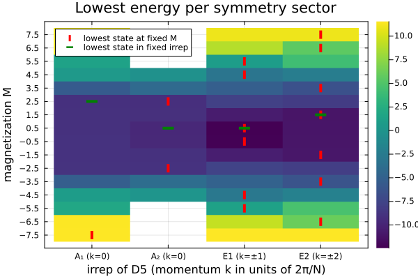

# Spatial symmetry sectors
This file demonstrates how to handle spatial symmetries like translations.
## Permutations and irreducible representations

Suppose a group $G$ acts on the sites of a system by permutations. Each
permutation induces an operator $U(g)$ on the Hilbert space. For an
irreducible character $\chi$, the projector onto its symmetry sector is

```math
P_\chi = \frac{d_\chi}{|G|}
    \sum_{g \in G} \chi(g)^* U(g),
\qquad d_\chi = \chi(e).
```

To calculate the projector, you need the permutation operator and the value
$\chi(g)$ for each $g$. FermionicHilbertSpaces.jl can
handle the permutations, but not the characters:
obtain them separately with e.g. [Oscar.jl](https://github.com/oscar-system/Oscar.jl). With a list of permutations and their weights for a particular irrep, `symmetric_sector(H, Hs, (perms, weights))` constructs a matrix whose columns form a basis for the sector.

## Example: a Heisenberg ring

Consider a spin chain with nearest-neighbour coupling and a
uniform field:

```math
H = J\sum_{k=1}^{N}\mathbf{S}_k\cdot\mathbf{S}_{k+1}
    - h\sum_{k=1}^{N}S^z_k,
\qquad \mathbf{S}_{N+1}=\mathbf{S}_1.
```

We first separate total-magnetization sectors $M=\sum_k S_k^z$,
then use the ring's translation and reflection symmetries.
These form the dihedral group $D_N$ of order $2N$.
Let's consider 5 sites, each with spin 3/2.

````julia
using FermionicHilbertSpaces, LinearAlgebra
using FermionicHilbertSpaces: SectorConstraint, SpinState

N = 5
J = 1.0
h = 0.04

@spins S 3 // 2
magnetization(s::SpinState) = s.m
space = hilbert_space(S, 1:N, SectorConstraint(sum; maps=magnetization))
mags = quantumnumbers(space)

H = J * sum(S[k][op] * S[mod1(k + 1, N)][op] for k in 1:N for op in (:x, :y, :z)) -
    h * sum(S[k][:z] for k in 1:N)
````

````
Sum with 20 terms: 
S[1][:z]*S[2][:z]+S[1][:z]*S[5][:z]+0.5*S[2][:-]*S[3][:+] + ...
````

Oscar supplies the group elements and character table. We convert each
element to a permutation vector that FermionicHilbertSpaces.jl can use.

````julia
using Oscar: PermGroup, dihedral_group, character_table
G = dihedral_group(PermGroup, 2N)
perms = map(Vector, G)
chis = character_table(G)
weights = [map(Float64 ∘ χ, G) for χ in chis];
````

Label each irrep using its dimension, the character of a one-site rotation,
and, for one-dimensional irreps, the character of a reflection. For this
even ring, the one-dimensional irreps are A₁, A₂, B₁, and B₂; the remaining
irreps Eₖ pair momenta +k and -k.

````julia
r = only(g for g in G if Vector(g) == [2:N; 1]) # rotation
σ = only(g for g in G if Vector(g) == [1; N:-1:2]) # reflection
function irrep_label(χ)
    d = round(Int, Float64(χ(one(G))))
    k = round(Int, N / (2π) * acos(Float64(χ(r)) / d))
    d == 2 && return "E$k (k=±$k)"
    return (k == 0 ? "A" : "B") *
        (Float64(χ(σ)) > 0 ? "₁" : "₂") * " (k=$k)"
end
labels = map(irrep_label, chis)
````

````
4-element Vector{String}:
 "A₁ (k=0)"
 "A₂ (k=0)"
 "E1 (k=±1)"
 "E2 (k=±2)"
````

In each magnetization sector, `symmetric_sector` constructs a matrix `P`
whose columns form a basis for an irrep's subspace. `factors(sec)` identifies
the tensor factors permuted by the group. We diagonalize $P^\dagger H P$;
an absent irrep gets energy `Inf`.

````julia
using KrylovKit, OhMyThreads
function sector_energies(M)
    sec = sector(M, space)
    HM = real(representation(H, sec))
    return map(weights) do w
        P = symmetric_sector(sec, factors(sec), (perms, w))
        size(P, 2) == 0 && return Inf
        eigsolve(Hermitian(P' * HM * P), 1, :SR; tol=1e-6, ishermitian=true)[1][1]
    end
end
energies = stack(tmap(sector_energies, mags; scheduler=DynamicScheduler()))
E0, idx = findmin(energies)
(; E0, irrep=labels[idx[1]], M=mags[idx[2]])
````

````
(E0 = -12.452645032783657, irrep = "E1 (k=±1)", M = 1/2)
````

Let's plot the results. The heatmap shows the lowest energy in each (irrep, $M$) block. Green marks the lowest energy for each irrep; red marks the lowest energy for each magnetization.

````julia
using Plots
best_irrep_per_M = map(argmin, eachcol(energies))
best_M_per_irrep = map(argmin, eachrow(energies))
p = heatmap(labels, mags, permutedims(energies);
    xlabel="irrep of D$N (momentum k in units of 2π/N)",
    ylabel="magnetization M",
    title="Lowest energy per symmetry sector",
    c=:viridis, yticks=mags, frame=:box)
scatter!(p, labels[best_irrep_per_M], mags;
    marker=:vline, markersize=6, markerstrokewidth=5,
    color=:red, label="lowest state at fixed M")
scatter!(p, labels, mags[best_M_per_irrep];
    marker=:hline, markersize=8, markerstrokewidth=5,
    color=:green, label="lowest state in fixed irrep")
````


---

*This page was generated using [Literate.jl](https://github.com/fredrikekre/Literate.jl).*

